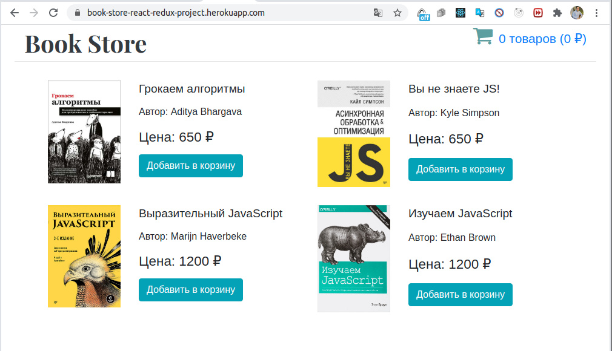
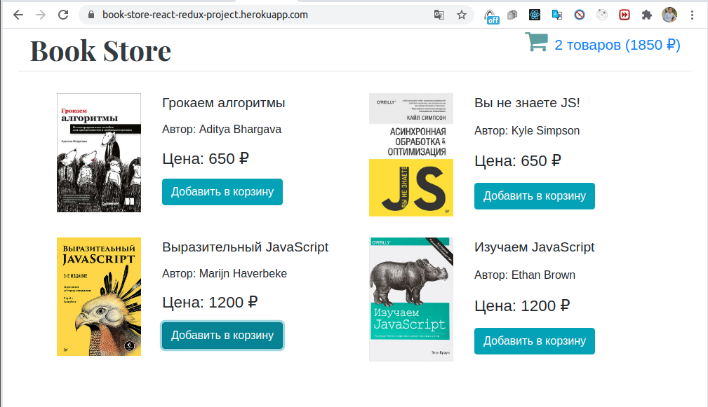
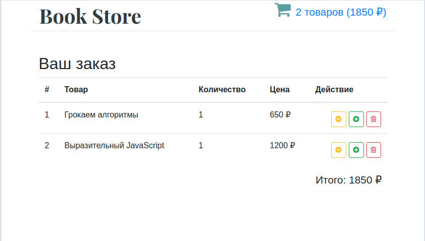
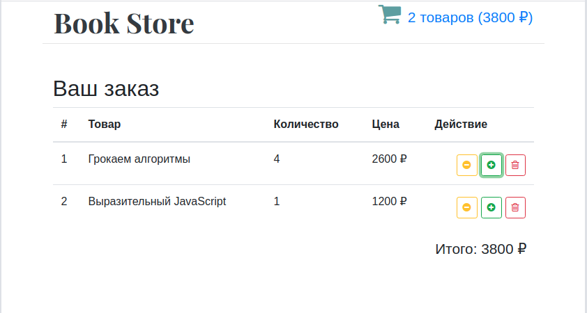
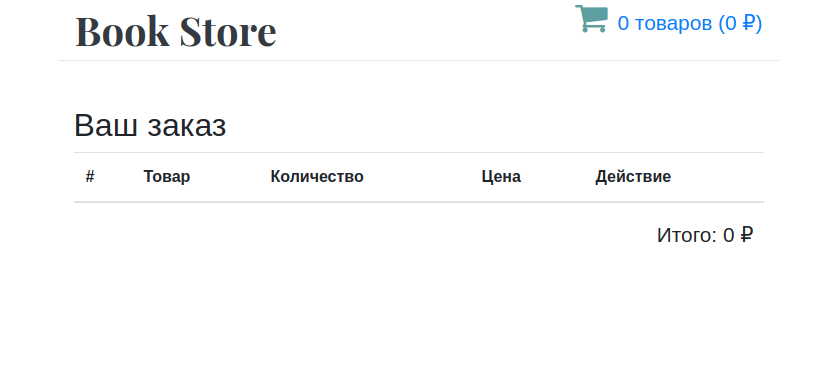

# BOOK STORE React-Redux

### [Ссылка приложения на heroku ](https://book-store-react-redux-project.herokuapp.com/)

Мини приложение для проработки паттернов React-Redux.

 ## Описание приложения:
 
 *Рисунок 1. Главная страница* 
 
 
 
 Главная страница, где отображенны список товаров, и их информация. Вы можете добавить в карзину.
 При добавлении в карзину, статус корзины в правом углу менятся. 
 Добавим например: 'Грокаем алгоритмы' 1 шт и 'Выразительный JavaScript'
 
 ---
 
  *Рисунок 2. Главная страница (корзина)* 
  
 
 
 Результат виден в правом углу. Теперь перейдем в саму корзину.
 
 ---
 
 
  *Рисунок 3. Корзина (сразу после перехода)* 
  
 
 
 Здесь мы можем добавить количество товаров, убавить либо вовсе очистить.
 
 ---
 
 *Рисунок 4. Добавление количества книг* 
   
 
 
 ---
 
  *Рисунок 5. Удаление товаров* 
    
  
  
  
